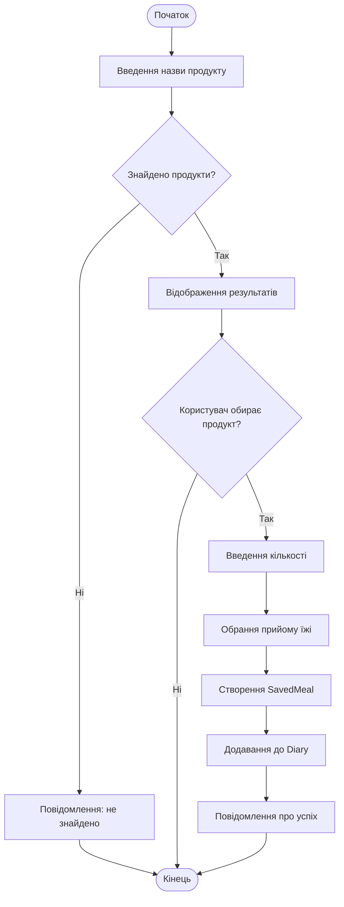
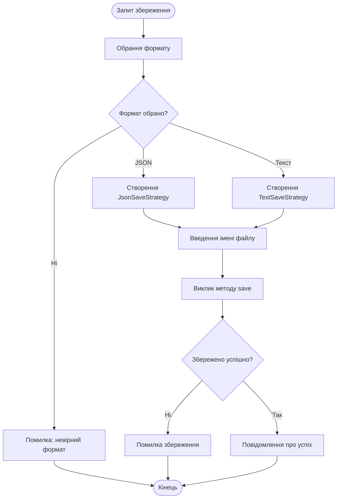
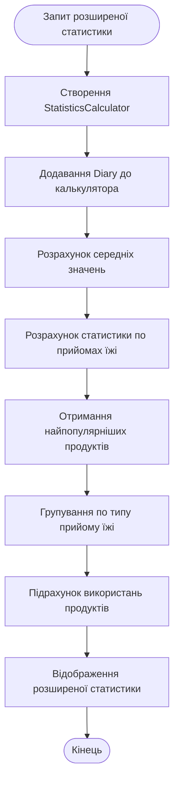

# Діаграми активності (Activity Diagrams)

## 1. Додавання продукту до щоденника



## 2. Розрахунок статистики дня

```mermaid
flowchart TD
    Start([Запит статистики]) --> GetMeals[Отримання всіх прийомів їжі]
    GetMeals --> CheckEmpty{Щоденник порожній?}
    CheckEmpty -->|]}EmptyMessage[Відображення: щоденник порожній]
    EmptyMessage --> End([Кінець])
    CheckEmpty -->|Ні| CalculateCalories[Розрахунок калорій]
    CalculateCalories --> CalculateCarbs[Розрахунок вуглеводів]
    CalculateCarbs --> CalculateProtein[Розрахунок білків]
    CalculateProtein --> CalculateFat[Розрахунок жирів]
    CalculateFat --> GetGoal[Отримання цілі калорій]
    GetGoal --> CalculateRemaining[Розрахунок залишку]
    CalculateRemaining --> DisplayStats[Відображення статистики]
    DisplayStats --> End
```

## 3. Збереження щоденника



## 4. Розширена статистика




