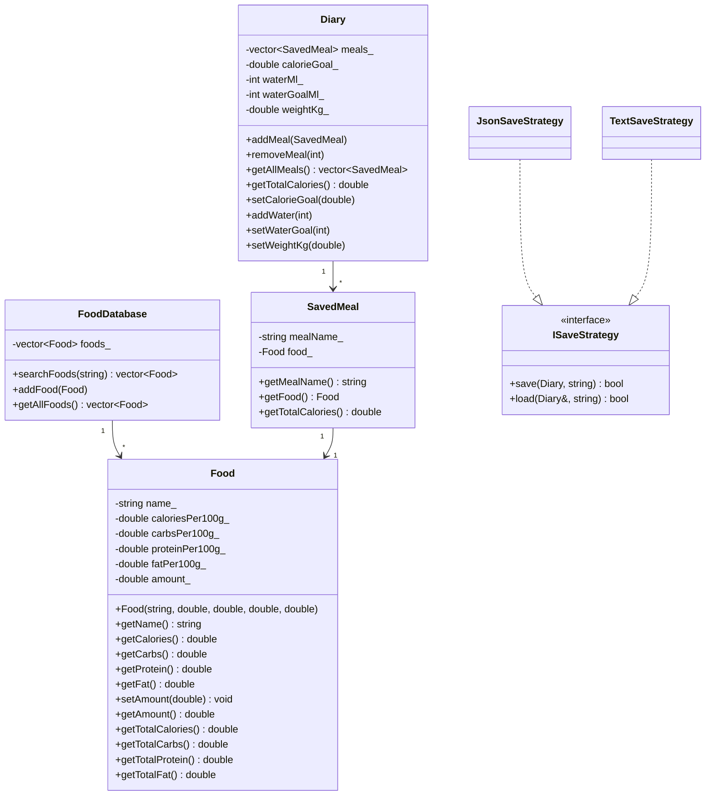

# Class Diagram

Структура основних класів і зв’язків.

```mermaid
classDiagram
    class Food {
        -string name_
        -double caloriesPer100g_
        -double carbsPer100g_
        -double proteinPer100g_
        -double fatPer100g_
        -double amount_
        +Food(string, double, double, double, double)
        +getName() string
        +getCalories() double
        +getCarbs() double
        +getProtein() double
        +getFat() double
        +setAmount(double) void
        +getAmount() double
        +getTotalCalories() double
        +getTotalCarbs() double
        +getTotalProtein() double
        +getTotalFat() double
    }

    class FoodDatabase {
        -vector~Food~ foods_
        +searchFoods(string) vector~Food~
        +addFood(Food)
        +getAllFoods() vector~Food~
    }

    class SavedMeal {
        -string mealName_
        -Food food_
        +getMealName() string
        +getFood() Food
        +getTotalCalories() double
    }

    class Diary {
        -vector~SavedMeal~ meals_
        -double calorieGoal_
        -int waterMl_
        -int waterGoalMl_
        -double weightKg_
        +addMeal(SavedMeal)
        +removeMeal(int)
        +getAllMeals() vector~SavedMeal~
        +getTotalCalories() double
        +setCalorieGoal(double)
        +addWater(int)
        +setWaterGoal(int)
        +setWeightKg(double)
    }

    class ISaveStrategy {
        <<interface>>
        +save(Diary, string) bool
        +load(Diary&, string) bool
    }

    class JsonSaveStrategy { }
    class TextSaveStrategy { }

    FoodDatabase "1" --> "*" Food
    SavedMeal "1" --> "1" Food
    Diary "1" --> "*" SavedMeal
    JsonSaveStrategy ..|> ISaveStrategy
    TextSaveStrategy ..|> ISaveStrategy
```

Коротко: `FoodDatabase` надає дані, `Diary` зберігає день, `ISaveStrategy` відповідає за файловий формат.

