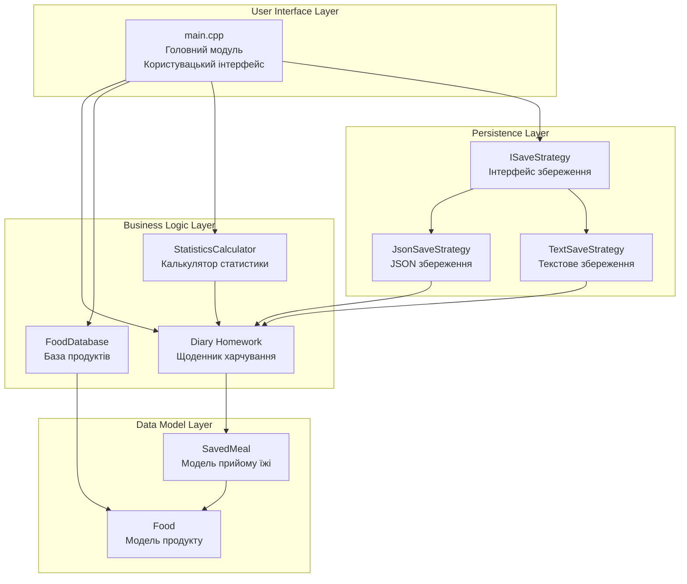
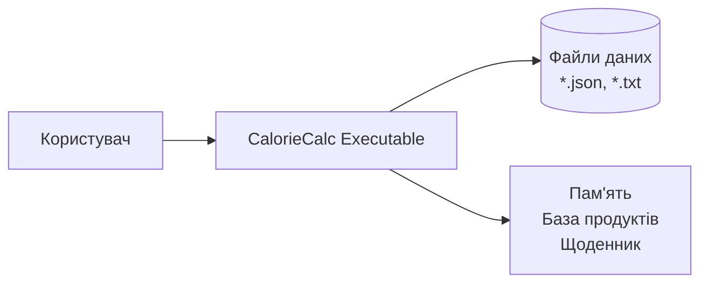

# Діаграма компонентів (Component Diagram)

## Опис

Діаграма компонентів показує архітектуру проєкту на рівні модулів та їх залежності.



## Компоненти та їх відповідальність

### User Interface Layer (Шар інтерфейсу користувача)

#### main.cpp
- **Відповідальність**: Обробка вводу користувача, відображення меню, координація між компонентами
- **Залежності**: Всі компоненти бізнес-логіки
- **Принцип**: Single Responsibility - тільки UI логіка

### Business Logic Layer (Шар бізнес-логіки)

#### Diary
- **Відповідальність**: Управління щоденником харчування, розрахунок статистики
- **Залежності**: SavedMeal
- **Принцип**: Інкапсуляція бізнес-логіки

#### FoodDatabase
- **Відповідальність**: Зберігання та пошук продуктів
- **Залежності**: Food
- **Принцип**: Репозиторій для доступу до даних

#### StatisticsCalculator
- **Відповідальність**: Розрахунок розширеної статистики
- **Залежності**: Diary
- **Принцип**: Розділення відповідальності

### Data Model Layer (Шар моделей даних)

#### Food
- **Відповідальність**: Представлення продукту харчування
- **Залежності**: Немає (базовий клас)
- **Принцип**: Value Object

#### SavedMeal
- **Відповідальність**: Представлення прийому їжі
- **Залежності**: Food
- **Принцип**: Композиція

### Persistence Layer (Шар персистентності)

#### ISaveStrategy
- **Відповідальність**: Визначення інтерфейсу збереження
- **Залежності**: Немає (абстракція)
- **Принцип**: Dependency Inversion

#### JsonSaveStrategy / TextSaveStrategy
- **Відповідальність**: Конкретна реалізація збереження
- **Залежності**: ISaveStrategy, Diary
- **Принцип**: Strategy Pattern

## Архітектурні принципи

1. **Розділення на шари**: Чітке розділення UI, бізнес-логіки, моделей та персистентності
2. **Залежність від абстракцій**: Шари залежать від інтерфейсів, а не реалізацій
3. **Модульність**: Кожен компонент має чітку відповідальність
4. **Розширюваність**: Легко додати нові стратегії збереження

## Структура залежностей

```
main.cpp
  ├── Diary
  │     └── SavedMeal
  │           └── Food
    ├── FoodDatabase
  │     └── Food
  ├── StatisticsCalculator
  │     └── Diary
  │           └── SavedMeal
              └── Food
  └── ISaveStrategy (interface)
        ├── JsonSaveStrategy
        │     └── Diary
        └── TextSaveStrategy
              └── Diary
```

## Deployment View



### Deployment компоненти:
- **Executable**: Скомпільований бінарний файл CalorieCalc
- **Data Files**: Файли збереження (JSON або текстовий формат)
- **Memory**: Робоча пам'ять для бази продуктів та поточного щоденника

