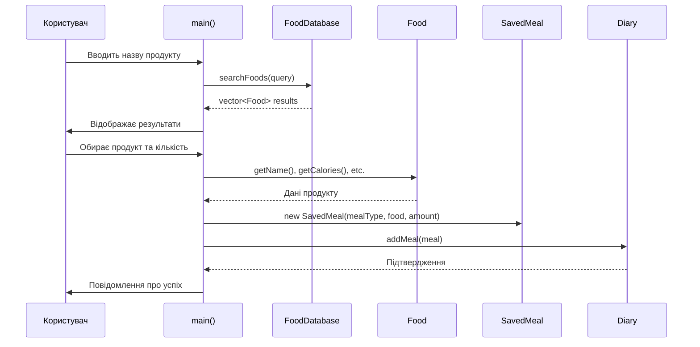
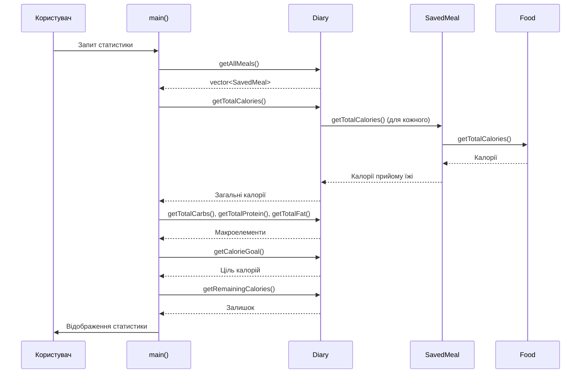
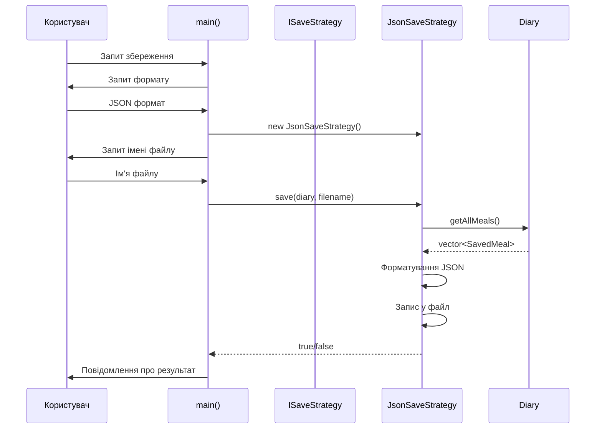
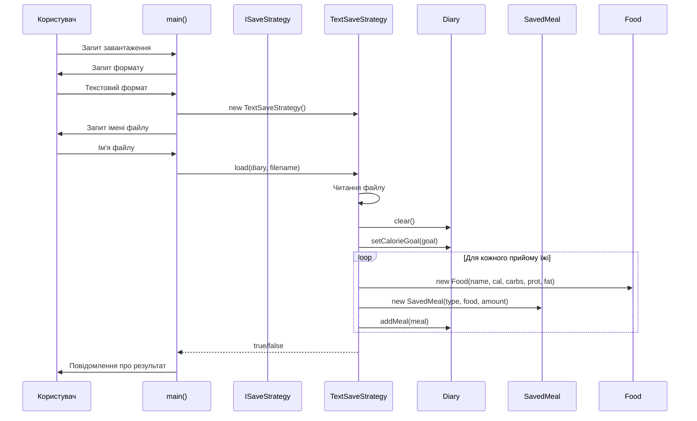
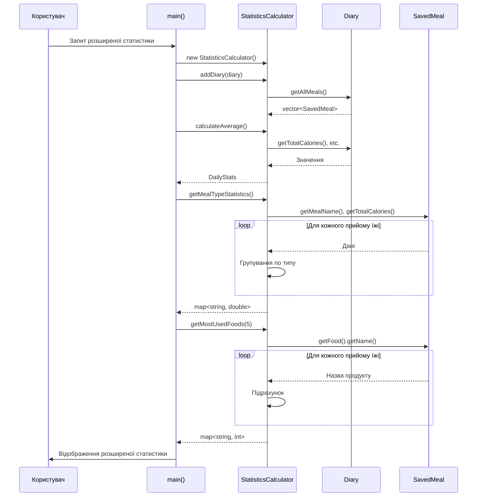

# Діаграми послідовності (Sequence Diagrams)

## 1. Додавання продукту до щоденника

## 2. Розрахунок статистики дня

## 3. Збереження щоденника

## 4. Завантаження щоденника

## 5. Розширена статистика

