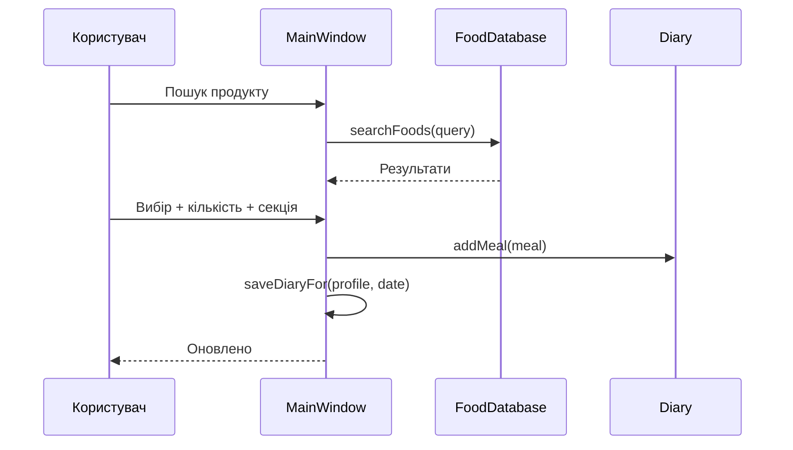
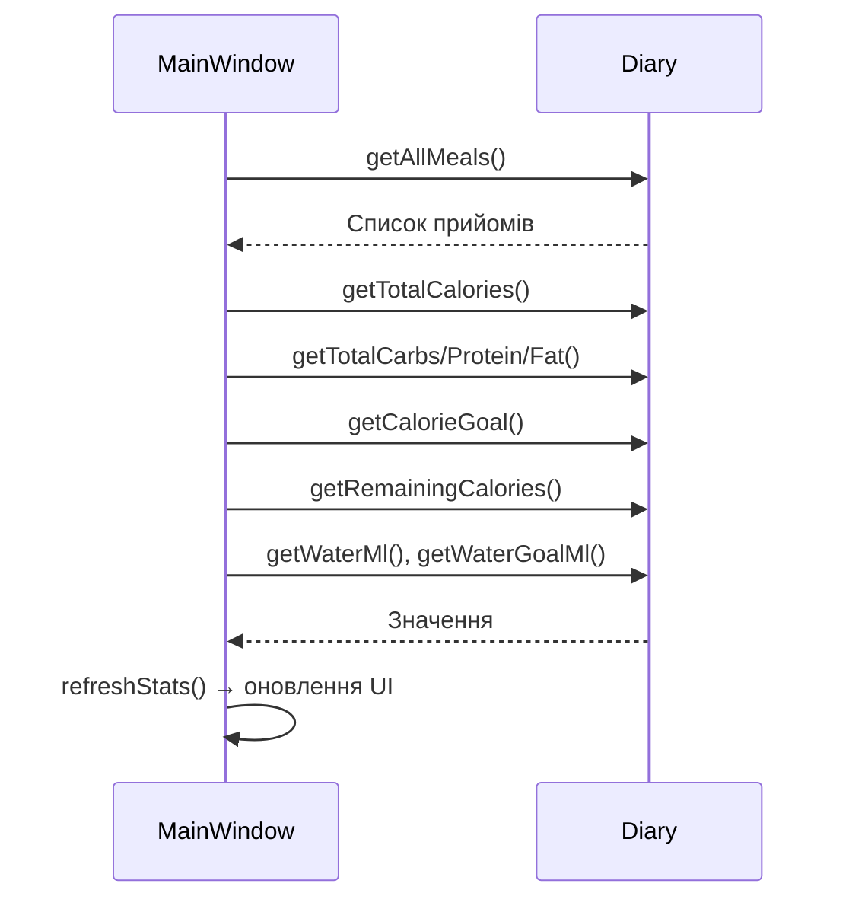
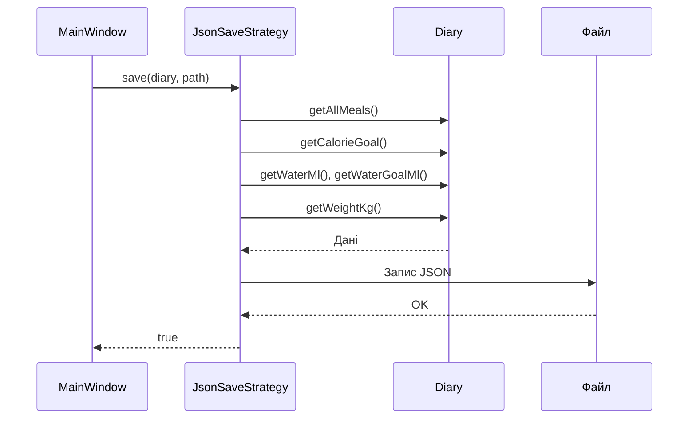
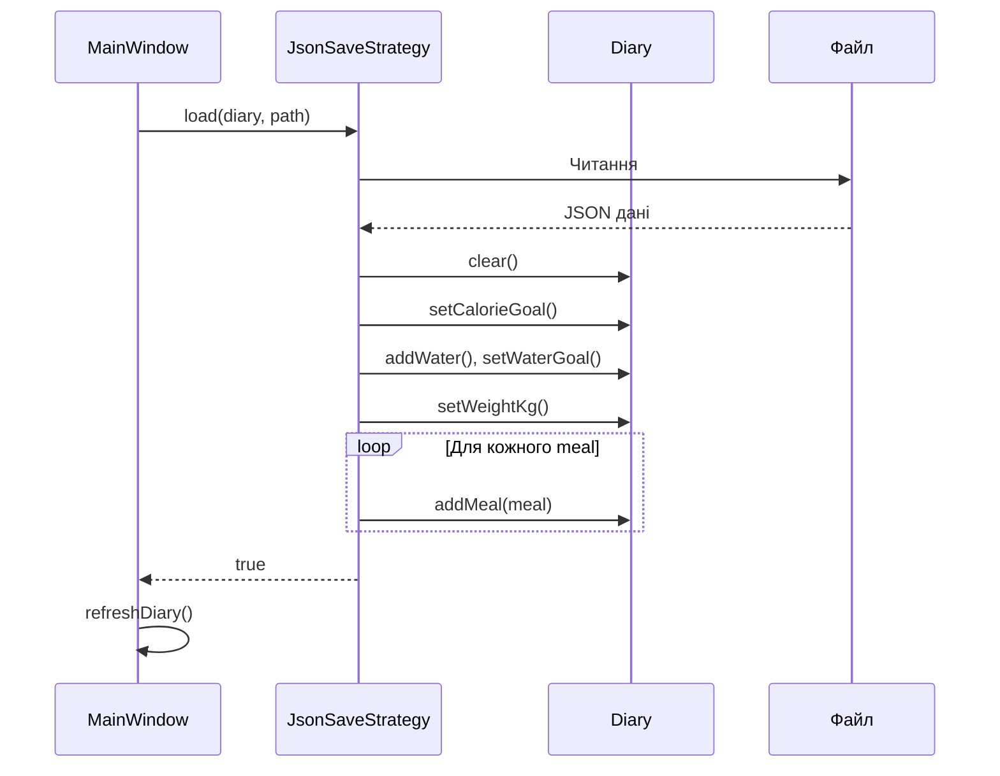
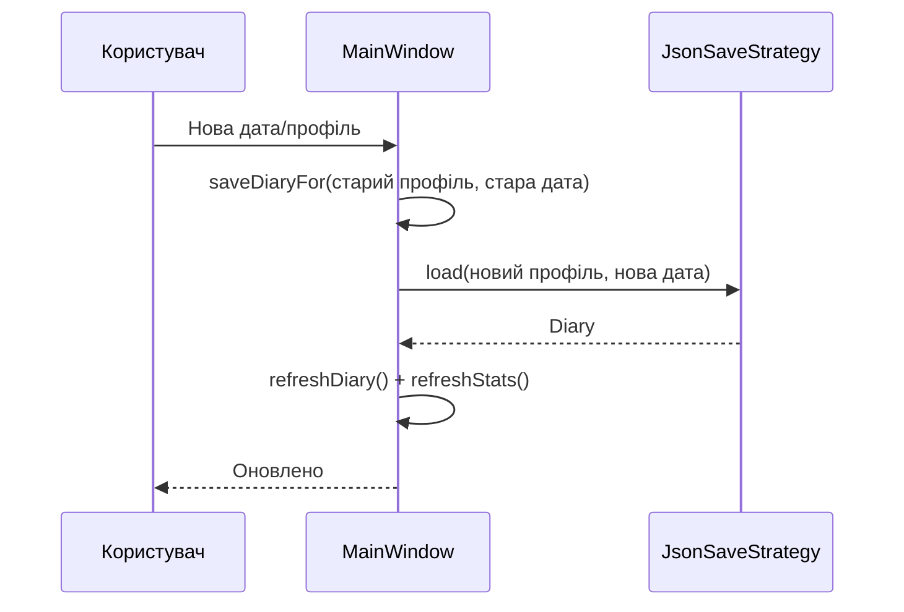

# Sequence Diagrams

Діаграми послідовності для ключових сценаріїв.

## Додавання продукту

```mermaid
sequenceDiagram
    participant User as Користувач
    participant GUI as MainWindow
    participant DB as FoodDatabase
    participant Diary as Diary

    User->>GUI: Пошук продукту
    GUI->>DB: searchFoods(query)
    DB-->>GUI: Результати
    User->>GUI: Вибір + кількість + секція
    GUI->>Diary: addMeal(meal)
    GUI->>GUI: saveDiaryFor(profile, date)
    GUI-->>User: Оновлено
```

## Розрахунок статистики

```mermaid
sequenceDiagram
    participant GUI as MainWindow
    participant Diary as Diary

    GUI->>Diary: getAllMeals()
    Diary-->>GUI: Список прийомів
    GUI->>Diary: getTotalCalories()
    GUI->>Diary: getTotalCarbs/Protein/Fat()
    GUI->>Diary: getCalorieGoal()
    GUI->>Diary: getRemainingCalories()
    GUI->>Diary: getWaterMl(), getWaterGoalMl()
    Diary-->>GUI: Значення
    GUI->>GUI: refreshStats() → оновлення UI
```

## Збереження (JSON)

```mermaid
sequenceDiagram
    participant GUI as MainWindow
    participant Strategy as JsonSaveStrategy
    participant Diary as Diary
    participant File as Файл

    GUI->>Strategy: save(diary, path)
    Strategy->>Diary: getAllMeals()
    Strategy->>Diary: getCalorieGoal()
    Strategy->>Diary: getWaterMl(), getWaterGoalMl()
    Strategy->>Diary: getWeightKg()
    Diary-->>Strategy: Дані
    Strategy->>File: Запис JSON
    File-->>Strategy: OK
    Strategy-->>GUI: true
```

## Завантаження

```mermaid
sequenceDiagram
    participant GUI as MainWindow
    participant Strategy as JsonSaveStrategy
    participant Diary as Diary
    participant File as Файл

    GUI->>Strategy: load(diary, path)
    Strategy->>File: Читання
    File-->>Strategy: JSON дані
    Strategy->>Diary: clear()
    Strategy->>Diary: setCalorieGoal()
    Strategy->>Diary: addWater(), setWaterGoal()
    Strategy->>Diary: setWeightKg()
    loop Для кожного meal
        Strategy->>Diary: addMeal(meal)
    end
    Strategy-->>GUI: true
    GUI->>GUI: refreshDiary()
```

## Перемикання дня/профілю

```mermaid
sequenceDiagram
    participant User as Користувач
    participant GUI as MainWindow
    participant Strategy as JsonSaveStrategy

    User->>GUI: Нова дата/профіль
    GUI->>GUI: saveDiaryFor(старий профіль, стара дата)
    GUI->>Strategy: load(новий профіль, нова дата)
    Strategy-->>GUI: Diary
    GUI->>GUI: refreshDiary() + refreshStats()
    GUI-->>User: Оновлено
```
