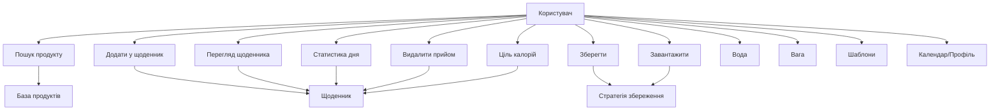

# Use Case

Ключові взаємодії користувача з застосунком.

## Сценарії (стисло)
- Пошук продукту: введення назви → результати з бази.
- Додавання: вибір продукту, кількість, секція → запис у щоденник.
- Статистика: сума калорій/макро, прогрес до цілі, вода.
- Календар/Профіль: перемикає день/сховище даних.
- Збереження/Завантаження: JSON по даті/профілю.

