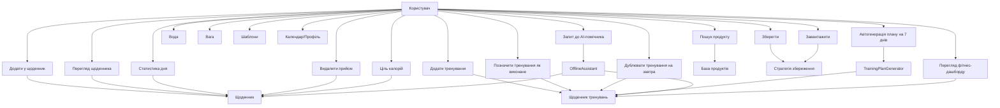

# Use Case

Ключові взаємодії користувача з застосунком.

```mermaid
graph TB
    User[Користувач] --> SearchFood[Пошук продукту]
    User --> AddFood[Додати у щоденник]
    User --> ViewDiary[Перегляд щоденника]
    User --> ViewStats[Статистика дня]
    User --> DeleteMeal[Видалити прийом]
    User --> SetGoal[Ціль калорій]
    User --> SaveDiary[Зберегти]
    User --> LoadDiary[Завантажити]
    User --> Water[Вода]
    User --> Weight[Вага]
    User --> Templates[Шаблони]
    User --> Calendar[Календар/Профіль]
    User --> AddTraining[Додати тренування]
    User --> GeneratePlan[Автогенерація плану на 7 днів]
    User --> CompleteTraining[Позначити тренування як виконане]
    User --> DuplicateTraining[Дублювати тренування на завтра]
    User --> AskAssistant[Запит до AI-помічника]
    User --> ViewFitnessDashboard[Перегляд фітнес-дашборду]

    SearchFood --> FoodDatabase[База продуктів]
    AddFood --> Diary[Щоденник]
    ViewDiary --> Diary
    ViewStats --> Diary
    DeleteMeal --> Diary
    SetGoal --> Diary
    SaveDiary --> SaveStrategy[Стратегія збереження]
    LoadDiary --> SaveStrategy
    AddTraining --> TrainingDiary[Щоденник тренувань]
    CompleteTraining --> TrainingDiary
    DuplicateTraining --> TrainingDiary
    GeneratePlan --> PlanGenerator[TrainingPlanGenerator]
    PlanGenerator --> TrainingDiary
    AskAssistant --> OfflineAssistant[OfflineAssistant]
    OfflineAssistant --> Diary
    OfflineAssistant --> TrainingDiary
    ViewFitnessDashboard --> TrainingDiary
```

## Сценарії (стисло)
- Пошук продукту: введення назви → результати з бази.
- Додавання: вибір продукту, кількість, секція → запис у щоденник.
- Статистика: сума калорій/макро, прогрес до цілі, вода.
- Календар/Профіль: перемикає день/сховище даних.
- Збереження/Завантаження: JSON по даті/профілю.
- Додавання тренування: тип/час/тривалість/статус → запис у щоденник тренувань.
- Автоплан на 7 днів: генерація сесій під ціль (схуднення/набір/підтримка) з пропуском уже заповнених днів.
- Швидкі дії: позначення тренування виконаним і дублювання на наступний день.
- AI-помічник: користувач ставить питання → система формує локальні рекомендації за даними харчування і тренувань.

