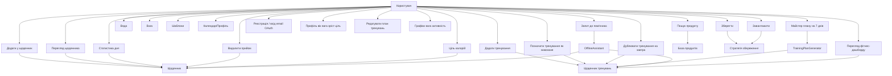

# Use Case

Ключові взаємодії користувача з застосунком.

## CalorieCalc (контекст проєкту)

Десктопний застосунок для персоналізованих тренувань і контролю харчування з локальним помічником.

**Опис:** застосунок для тренувань, підрахунку калорій і персональних рекомендацій на основі профілю та щоденника.

**Проблема:** користувачам складно самостійно формувати послідовні тренування, контролювати харчування та відстежувати прогрес.

**Рішення:** застосунок допомагає створювати персональні тренування, вести щоденник харчування/активності та отримувати контекстні поради (офлайн).

```mermaid
graph TB
    User[Користувач] --> SearchFood[Пошук продукту]
    User --> AddFood[Додати у щоденник]
    User --> ViewDiary[Перегляд щоденника]
    User --> ViewStats[Статистика дня]
    User --> DeleteMeal[Видалити прийом]
    User --> SetGoal[Ціль калорій]
    User --> SaveDiary[Зберегти]
    User --> LoadDiary[Завантажити]
    User --> Water[Вода]
    User --> Weight[Вага]
    User --> Templates[Шаблони]
    User --> Calendar[Календар/Профіль]
    User --> AddTraining[Додати тренування]
    User --> GeneratePlan[Майстер плану на 7 днів]
    User --> CompleteTraining[Позначити тренування як виконане]
    User --> DuplicateTraining[Дублювати тренування на завтра]
    User --> RegisterLogin[Реєстрація / вхід email OAuth]
    User --> EditProfile[Профіль вік вага зріст ціль]
    User --> EditTrainingPlan[Редагувати план тренувань]
    User --> ViewCharts[Графіки вага активність]
    User --> AskAssistant[Запит до помічника]
    User --> ViewFitnessDashboard[Перегляд фітнес-дашборду]

    SearchFood --> FoodDatabase[База продуктів]
    AddFood --> Diary[Щоденник]
    ViewDiary --> Diary
    ViewStats --> Diary
    DeleteMeal --> Diary
    SetGoal --> Diary
    SaveDiary --> SaveStrategy[Стратегія збереження]
    LoadDiary --> SaveStrategy
    AddTraining --> TrainingDiary[Щоденник тренувань]
    CompleteTraining --> TrainingDiary
    DuplicateTraining --> TrainingDiary
    GeneratePlan --> PlanGenerator[TrainingPlanGenerator]
    PlanGenerator --> TrainingDiary
    AskAssistant --> OfflineAssistant[OfflineAssistant]
    OfflineAssistant --> Diary
    OfflineAssistant --> TrainingDiary
    ViewFitnessDashboard --> TrainingDiary
```

## Сценарії (стисло)
- Пошук продукту: введення назви → результати з бази.
- Додавання: вибір продукту, кількість, секція → запис у щоденник.
- Статистика: сума калорій/макро, прогрес до цілі, вода.
- Календар/Профіль: перемикає день/сховище даних.
- Збереження/Завантаження: JSON по даті/профілю.
- Додавання тренування: тип/час/тривалість/статус → запис у щоденник тренувань.
- Майстер плану: валідація профілю → генерація → перегляд → помічник/регенерація → підтвердження → збереження (див. BPMN_TrainingPlanGeneration.md).
- Швидкі дії: позначення тренування виконаним і дублювання на наступний день.
- Помічник: користувач ставить питання → система формує локальні рекомендації за даними харчування і тренувань.
- Реєстрація (FR-1.1): email + пароль; вхід за логіном або email; локальний профіль через Google/Apple.
- Редагування плану (FR-2.2): кнопка «Редагувати план» для обраної сесії.
- Прогрес (FR-5): звіти, графіки, «Зведення прогресу».

Повний мапінг UR/FR/NFR: [Requirements_UR_FR_NFR.md](Requirements_UR_FR_NFR.md).

**User stories (epic тренувань):** [UserStories_WorkoutManagement.md](UserStories_WorkoutManagement.md) — п’ять історій з acceptance criteria (US-W1…US-W5).

**UC-01 (Start Workout) — блок-схема:** [Flowchart_StartWorkout_UC01.md](Flowchart_StartWorkout_UC01.md).

## Use Case Specification

### UC-01: Start Workout

**Description:** користувач запускає тренування. Система генерує персоналізований план і супроводжує виконання вправ.

**Primary actor:** User  
**Secondary actor:** CalorieCalc (System)

**Preconditions:**
- застосунок запущено;
- користувач має доступ до функціоналу тренувань;
- вхід у профіль необов'язковий (доступний обмежений гостьовий режим).

**Main scenario:**
1. Система відображає головний екран.
2. Користувач обирає `Start workout`.
3. Система перевіряє наявність персональних даних.
4. Якщо даних немає, система запитує мінімальні параметри (ціль, рівень, тривалість).
5. Користувач вводить дані.
6. Система валідує введені дані.
7. Система генерує тренувальний план.
8. Система відображає план.
9. Користувач починає виконувати вправи.
10. Система відстежує прогрес тренування.
11. Користувач завершує тренування.
12. Система зберігає результат і показує підсумок.

**Alternative scenarios:**
- **A1 (Quick Start):** користувач обирає швидкий старт; система пропускає введення персональних даних і генерує базовий план.

**Edge cases:**
- **E1:** персональні дані вже існують, тому кроки введення даних пропускаються.
- **E2:** користувач запускає тренування без логіну; система надає обмежений функціонал і базовий план.

**Error scenarios:**
- **ER1:** введено невалідні або неповні дані; система показує помилку валідації та повертає на крок введення.
- **ER2:** внутрішня помилка генерації плану; система показує повідомлення про помилку і пропонує повторити спробу.

**Postconditions:**
- тренування завершено;
- результат збережено;
- користувач може переглянути прогрес у статистиці.

**Rules and restrictions:**
- без авторизації доступні лише базові сценарії;
- тривалість тренування має належати до допустимого діапазону;
- персоналізація плану залежить від повноти профільних даних.

